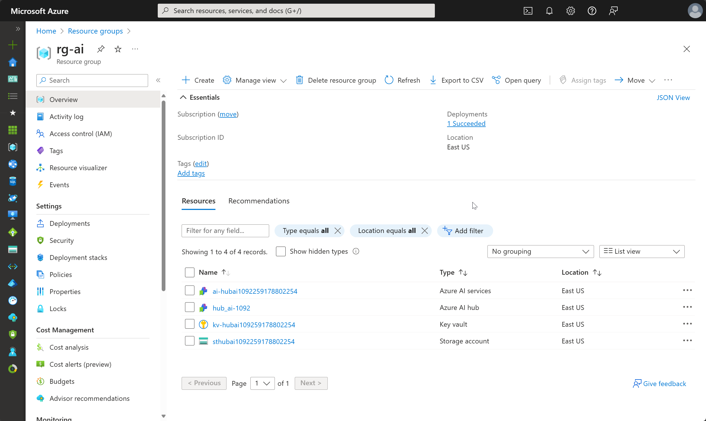

---
lab:
  title: Exploración de los componentes y herramientas de Inteligencia artificial de Azure Studio
---

# Exploración de los componentes y herramientas de Inteligencia artificial de Azure Studio

En este ejercicio, usarás Inteligencia artificial de Azure Studio para crear un proyecto y explorar un modelo de IA generativa.

Este ejercicio dura aproximadamente **30** minutos.

## Abrir Inteligencia artificial de Azure Studio

Comencemos por explorar Inteligencia artificial de Azure Studio.

1. En un explorador web, abre [https://ai.azure.com](https://ai.azure.com) e inicia sesión con tus credenciales de Azure. La siguiente imagen muestra la página principal de Inteligencia artificial de Azure Studio:

    

1. Revisa la información de la página principal y mira cada una de las pestañas, teniendo en cuenta las opciones para explorar modelos y funcionalidades, crear proyectos y administrar recursos.

## Creación de un centro de Azure AI

Necesitas un centro de Azure AI en tu suscripción de Azure para hospedar proyectos. Puedes crear este recurso al crear un proyecto o aprovisionarlo con antelación (que es lo que haremos en este ejercicio).

1. En la sección **Administración**, selecciona **Todos los recursos** y, después, selecciona **+ Nuevo centro**. Crea un nuevo centro con la siguiente configuración:
    - **Nombre del centro**: *un nombre único*
    - **Suscripción**: *suscripción de Azure*
    - **Grupo de recursos**: *crea un nuevo grupo de recursos con un nombre único o selecciona uno existente*
    - **Ubicación**: selecciona **Ayúdeme a elegir** y, a continuación, selecciona **gpt-35-turbo** en la ventana Asistente de ubicación y usa la región recomendada\*
    - **Conectar Servicios de Azure AI o Azure OpenAI**: *selecciona esta opción para crear una nueva instancia de Servicios de IA o usar una existente*
    - **Conectar Búsqueda de Azure AI**: omitir la conexión

    > \* Los recursos de Azure OpenAI están restringidos en el nivel de inquilino por cuotas regionales. Las regiones enumeradas incluyen la cuota predeterminada para los tipos de modelo usados en este ejercicio. Elegir aleatoriamente una región reduce el riesgo de que una sola región alcance su límite de cuota en escenarios en los que se comparte una suscripción con otros usuarios. En caso de que se alcance un límite de cuota más adelante en el ejercicio, es posible que tengas que crear otro recurso en otra región.

1. Selecciona **Siguiente** y revisa tu configuración.
1. Selecciona **Crear** y espera a que se complete el proceso.
   
    La siguiente imagen ejemplifica lo que deberías ver tras crear el centro de Azure AI:

    

1. Abre una nueva pestaña del explorador (dejando abierta la pestaña Inteligencia artificial de Azure Studio) y ve a Azure Portal en [https://portal.azure.com](https://portal.azure.com?azure-portal=true), inicia sesión con tus credenciales de Azure si se te solicita.
1. Ve al grupo de recursos en el que creaste el centro de Azure AI y mira los recursos de Azure que se han creado.

    

1. Vuelve a la pestaña del explorador de Inteligencia artificial de Azure Studio.
1. Mira cada una de las páginas del panel en el lado izquierdo de la página del centro de Azure AI y anota los artefactos que puedes crear y administrar. En la página **Conexiones**, observa que ya se han creado las conexiones a Azure OpenAI y los servicios de IA.

## Creación de un proyecto

Un centro de Azure AI proporciona un área de trabajo de colaboración en la que puedes definir uno o varios *proyectos*. Vamos a crear un proyecto en el centro de Azure AI.

1. En Inteligencia artificial de Azure Studio, asegúrate de que está en el centro que acabas de crear (puedes comprobar la ubicación al comprobar la ruta de acceso en la parte superior de la pantalla).
1. Ve a **Todos los proyectos** con el menú de la izquierda.
1. Selecciona **+ Nuevo proyecto**.
1. En el asistente para **Crear un nuevo proyecto**, crea un proyecto con la siguiente configuración:
    - **Centro actual**: *Su centro de Azure AI*
    - **Nombre del proyecto**: *Un nombre exclusivo para el proyecto*
1. Espere a que se cree el proyecto. El resultado debe tener un aspecto similar a la imagen siguiente:

    

1. Vea las páginas del panel de la izquierda, expanda cada sección y anote las tareas que puede realizar y los recursos que puede administrar en un proyecto.

## Implementación y prueba de un modelo

Puede usar un proyecto para crear soluciones de inteligencia artificial complejas basadas en modelos de IA generativa. Una exploración completa de todas las opciones de desarrollo disponibles en Inteligencia artificial de Azure Studio excede el propósito de este ejercicio, pero exploraremos algunas formas básicas de trabajar con modelos en un proyecto.

1. En el panel en el lado izquierdo del proyecto, en la sección **Componentes**, seleccione la página **Implementaciones**.
1. En la página **Implementaciones**, en la pestaña **Implementaciones de modelos**, selecciona **+ Implementación de un modelo**.
1. Busque el modelo **gpt-35-turbo** de la lista, seleccione y confirme.
1. Implemente el modelo con la siguiente configuración:
    - **Nombre de implementación**: *Un nombre único para la implementación de modelo*
    - **Tipo de implementación**: estándar
    - **Versión del modelo**: *Selecciona la versión predeterminada*
    - **Recurso de IA**: *selecciona el recurso creado anteriormente*
    - **Límite de frecuencia de tokens por minuto (miles)**: 5000
    - **Filtro de contenido**: DefaultV2
    - **Habilitación de la cuota dinámica**: deshabilitada
      
    > **Nota**: Reducir el TPM ayuda a evitar el uso excesivo de la cuota disponible en la suscripción que está usando. 5000 TPM es suficiente para los datos que se usan en este ejercicio.

1. Una vez implementado el modelo, en la página de información general de implementación, seleccione **Abrir en el área de juegos**.
1. En la página **Área de juegos de chat**, asegúrese de que la implementación del modelo esté seleccionada en la sección **Implementación**.
1. En la ventana de chat, escriba una consulta como *¿Qué es la inteligencia artificial?* y vea la respuesta:

    

## Limpiar

Si ha terminado de explorar Inteligencia artificial de Azure Studio, debe eliminar los recursos que ha creado en este ejercicio para evitar incurrir en costos innecesarios de Azure.

1. Vuelva a la pestaña del explorador que contiene Azure Portal (o vuelva a abrir [Azure Portal](https://portal.azure.com?azure-portal=true) en una nueva pestaña del explorador) y vea el contenido del grupo de recursos donde implementó los recursos usados en este ejercicio.
1. Seleccione **Eliminar grupo de recursos** en la barra de herramientas.
1. Escriba el nombre del grupo de recursos y confirme que desea eliminarlo.
